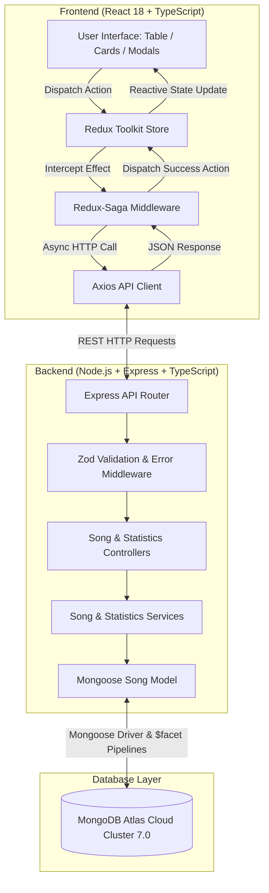

# 🎵 Swenetix Studio (`swenetix-studio`)
### Production Full-Stack Song Management Application & Analytics Platform
Built for the **Addis Software Test Project - MERN Stack** assessment.

[](https://swenetixstudio.vercel.app/songs)
[](https://swenetix-studio.onrender.com/api/health)
[](https://github.com)
[](https://cloud.mongodb.com)
[](https://docker.com)
[](https://typescriptlang.org)

🌐 **Live Deployments:**
- **Frontend Web App (Vercel)**: [https://swenetixstudio.vercel.app/songs](https://swenetixstudio.vercel.app/songs)
- **Backend REST API (Render)**: [https://swenetix-studio.onrender.com/api](https://swenetix-studio.onrender.com/api)
- **API Healthcheck**: [https://swenetix-studio.onrender.com/api/health](https://swenetix-studio.onrender.com/api/health)

> 📚 **Developer & Engineering Documentation Guides:**
> - [🏛️ System Architecture & Design](./docs/ARCHITECTURE.md)
> - [👨‍💻 Developer Onboarding & Contribution Guide](./docs/DEVELOPER_GUIDE.md)
> - [📡 Complete REST API Reference](./docs/API_DOCUMENTATION.md)
> - [🚀 Production Deployment Guide (Vercel, Render, Docker)](./docs/DEPLOYMENT_GUIDE.md)

---

## 📑 Table of Contents
1. [Executive Summary](#-executive-summary)
2. [Developer Documentation Hub](#-developer-documentation-hub)
3. [Core Requirements & Compliance Matrix](#-core-requirements--compliance-matrix)
4. [System Architecture & Data Flow](#-system-architecture--data-flow)
5. [Key Features & UI Highlights](#-key-features--ui-highlights)
6. [Technology Stack](#-technology-stack)
7. [Deep Dive: MongoDB Aggregation Pipeline (`$facet`)](#-deep-dive-mongodb-aggregation-pipeline-facet)
8. [Deep Dive: Redux-Saga Reactive Flow](#-deep-dive-redux-saga-reactive-flow)
9. [Folder & Codebase Structure](#-folder--codebase-structure)
10. [REST API Endpoints Specification](#-rest-api-endpoints-specification)
11. [Local Development & Setup Guide](#-local-development--setup-guide)
12. [Docker Deployment Guide](#-docker-deployment-guide)
13. [Cloud Hosting (Render & Vercel)](#-cloud-hosting-render--vercel)

---

## 🎯 Executive Summary

**Swenetix Studio** is a full-stack song management platform built using the **MERN (MongoDB, Express, React, Node.js) Stack** with end-to-end **TypeScript**.

The application provides:
- Seamless **CRUD operations** for music tracks with reactive, non-reloading UI updates.
- Real-time catalog analytics powered by MongoDB's multi-stage `$facet` aggregation pipelines.
- Modern **Emotion & Styled-System** UI design system with Light/Dark mode and an interactive collapsible (pop-up/pop-off) fixed sidebar.
- Multi-container containerization via **Docker** and **Docker Compose**.

---

## 🌟 Core Requirements & Compliance Matrix

| Addis Software Specification | Technical Implementation in Swenetix Studio | Status |
| :--- | :--- | :---: |
| **MERN Stack** | MongoDB Atlas 7.0 + Express.js 4 + React 18 + Node.js (TypeScript) | ✅ **100% Compliant** |
| **Single Song Model** | Schema with `title`, `artist`, `album`, `genre` (+ duration, timestamps, indexes) | ✅ **100% Compliant** |
| **REST API CRUD** | `POST /api/songs`, `GET /api/songs`, `GET /api/songs/:id`, `PUT /api/songs/:id`, `DELETE /api/songs/:id` | ✅ **100% Compliant** |
| **Overall Statistics** | Total songs, artists, albums, genres; songs per genre; songs & albums per artist; songs per album | ✅ **100% Compliant** (via `$facet`) |
| **Docker Packaging** | Multi-stage production `Dockerfile` (server & client) + `docker-compose.yml` | ✅ **100% Compliant** |
| **Strict TypeScript** | Typed interfaces across backend models, controllers, Redux state, and React components with **zero `any`** | ✅ **100% Compliant** |
| **Redux Toolkit** | Centralized slices for songs and statistics state management | ✅ **100% Compliant** |
| **Redux-Saga** | Generator workers with `takeLatest`, `call`, `put`, `select` handling all API queries and mutations | ✅ **100% Compliant** |
| **Emotion & Styled-System** | Theme tokens architecture (colors, typography, spacing, shadows) powering responsive primitives | ✅ **100% Compliant** |
| **Non-Reloading Reactivity** | Add, edit, or delete actions trigger seamless saga re-fetches without refreshing the page | ✅ **100% Compliant** |
| **Bonus: Search & Filtering** | Instant keyword search across title/artist/album + interactive genre filter pills carousel | ✅ **100% Compliant** |
| **Bonus: Multi-View & Cloud Ready** | Table View & Grid View toggle, Dark/Light mode, MongoDB Atlas integration, ready for Render/Vercel | ✅ **100% Compliant** |

---

## 🏗️ System Architecture & Data Flow



---

## 🎨 Key Features & UI Highlights

### 1. Visual Showcase Entry Point (`/`)
- 100vh dynamic canvas with a real-time animated red dot-matrix audio equalizer.
- Floating 3D studio headphones showcase with automatic background transparency rendering.
- Quick links to explore the catalog, review studio analytics, or create a song.

### 2. Song Management Library (`/songs`)
- **Table View & Card Grid View**: Seamless switch between dense data table and visual album cards.
- **Search & Multi-Attribute Filters**: Debounced keyword search across title, artist, album, and instant genre carousel pills.
- **Modal CRUD Workflows**: Fast, accessible modal dialogs for creating and editing songs with instant input validation and quick genre suggestion chips.
- **Safe Deletion**: Confirmation modal with instant removal without page reload.
- **Pagination**: Server-side paginated queries for smooth performance on large datasets.

### 3. Statistics & Analytics Dashboard (`/statistics`)
- **Top Metrics**: Total songs, unique artists, unique albums, and unique genres.
- **Songs by Genre Breakdown**: Real-time count and percentage bar indicators.
- **Artist Catalogs**: Ranked artist overview with song and album counts.
- **Album Collections**: Track counts grouped by album and artist.
- **Click-to-Filter**: Clicking on any genre or artist card immediately filters the song library.

### 4. Overview Hub (`/overview`)
- High-level executive dashboard with featured artist rankings, genre distributions, and recent additions.

### 5. Fixed Pop-Up / Pop-Off Sidebar
- Fixed `100vh` sticky layout on the left that remains stable while main content scrolls independently.
- **Logo Toggle**: Clicking the **Swenetix Studio** logo collapses the sidebar into a sleek 76px icon rail (pop-off) or expands it back out to 260px (pop-up).

---

## 💻 Technology Stack

### Frontend
- **Framework:** React 18
- **Build Tool:** Vite 5
- **Language:** TypeScript 5 (Strict Mode)
- **State Management:** Redux Toolkit 2
- **Side-Effect Management:** Redux-Saga 1.3
- **Styling:** `@emotion/styled`, `@emotion/react`, `styled-system`
- **Routing:** React Router v6
- **Icons:** `lucide-react`
- **HTTP Client:** Axios

### Backend
- **Runtime:** Node.js 20+
- **Framework:** Express.js 4
- **Language:** TypeScript 5
- **Database ODM:** Mongoose 8
- **Validation:** Zod
- **Dev Server:** `ts-node-dev`
- **Testing:** Jest + Supertest

### DevOps & Infrastructure
- **Containerization:** Docker (Multi-stage builds)
- **Orchestration:** Docker Compose
- **Cloud Database:** MongoDB Atlas 7.0

---

## 📊 Deep Dive: MongoDB Aggregation Pipeline (`$facet`)

Located in [`server/src/services/statistics.service.ts`](file:///e:/dasktopp/my_proj/song-management-app/server/src/services/statistics.service.ts).

Instead of issuing 4 separate queries to MongoDB, Swenetix Studio executes a single-stage `$facet` pipeline to compute all requested metrics simultaneously:

```typescript
const [result] = await Song.aggregate([
  {
    $facet: {
      // 1. Overall Totals: Total songs, unique artists, albums, genres
      overview: [
        {
          $group: {
            _id: null,
            totalSongs: { $sum: 1 },
            uniqueArtists: { $addToSet: '$artist' },
            uniqueAlbums: { $addToSet: '$album' },
            uniqueGenres: { $addToSet: '$genre' },
          },
        },
        {
          $project: {
            _id: 0,
            totalSongs: 1,
            totalArtists: { $size: '$uniqueArtists' },
            totalAlbums: { $size: '$uniqueAlbums' },
            totalGenres: { $size: '$uniqueGenres' },
          },
        },
      ],

      // 2. Count of songs grouped by genre
      songsByGenre: [
        { $group: { _id: '$genre', count: { $sum: 1 } } },
        { $sort: { count: -1, _id: 1 } },
        { $project: { _id: 0, genre: '$_id', count: 1 } },
      ],

      // 3. Count of songs and distinct albums per artist
      artists: [
        {
          $group: {
            _id: '$artist',
            totalSongs: { $sum: 1 },
            albums: { $addToSet: '$album' },
          },
        },
        {
          $project: {
            _id: 0,
            artist: '$_id',
            totalSongs: 1,
            totalAlbums: { $size: '$albums' },
          },
        },
        { $sort: { totalSongs: -1, artist: 1 } },
      ],

      // 4. Count of songs per album
      albums: [
        {
          $group: {
            _id: { album: '$album', artist: '$artist' },
            totalSongs: { $sum: 1 },
          },
        },
        {
          $project: {
            _id: 0,
            album: '$_id.album',
            artist: '$_id.artist',
            totalSongs: 1,
          },
        },
        { $sort: { totalSongs: -1, album: 1 } },
      ],
    },
  },
]);
```

---

## ⚡ Deep Dive: Redux-Saga Reactive Flow

Located in [`client/src/store/songsSaga.ts`](file:///e:/dasktopp/my_proj/song-management-app/client/src/store/songsSaga.ts).

Redux-Saga handles asynchronous side-effects using ES6 generator functions. Whenever a song is created, updated, or deleted, the saga automatically triggers a re-fetch of the song catalog and statistics without reloading the page:

```typescript
function* handleCreateSong(action: PayloadAction<CreateSongDto>): Generator {
  try {
    const newSong = (yield call(api.createSong, action.payload)) as Song;
    yield put(createSongSuccess(newSong));
    yield put(showToast({ message: `"${newSong.title}" added to library.`, type: 'success' }));

    // Seamlessly refresh library and analytical statistics without page reload
    yield put(fetchSongsRequest());
    yield put(fetchStatisticsRequest());
  } catch (error: unknown) {
    const message = error instanceof Error ? error.message : 'Failed to create song';
    yield put(createSongFailure(message));
    yield put(showToast({ message, type: 'error' }));
  }
}

export function* songsSaga(): Generator {
  yield takeLatest(fetchSongsRequest.type, handleFetchSongs);
  yield takeLatest(createSongRequest.type, handleCreateSong);
  yield takeLatest(updateSongRequest.type, handleUpdateSong);
  yield takeLatest(deleteSongRequest.type, handleDeleteSong);
}
```

---

## 📁 Folder & Codebase Structure

```text
song-management-app/
├── docker-compose.yml              # Multi-container orchestration (Mongo, Server, Client)
├── package.json                    # Root scripts runner
├── README.md                       # Complete documentation
│
├── server/                         # Express + TypeScript + Mongoose API
│   ├── Dockerfile                  # Multi-stage production build
│   ├── tsconfig.json               # Strict TypeScript config
│   ├── package.json
│   ├── .env.example
│   └── src/
│       ├── app.ts                  # Express application factory & middleware
│       ├── server.ts               # Server bootstrap & database connect
│       ├── config/                 # Environment & Mongoose connection options
│       ├── controllers/            # Song & Statistics HTTP controllers
│       ├── middleware/             # Validation & global error handler
│       ├── models/                 # Mongoose Song Schema & Indexes
│       ├── routes/                 # Express REST route endpoints
│       ├── services/               # CRUD business logic & $facet aggregation
│       ├── seeds/                  # Standalone database seed runner
│       └── types/                  # TypeScript DTOs & Interfaces
│
└── client/                         # React 18 + Redux-Saga + Emotion SPA
    ├── Dockerfile                  # Multi-stage build with Nginx
    ├── tsconfig.json               # Strict TypeScript config
    ├── vite.config.ts              # Vite configuration
    ├── package.json
    └── src/
        ├── App.tsx                 # Root layout with SidebarProvider & ThemeProvider
        ├── main.tsx                # Mounts Redux Provider & React DOM
        ├── context/                # Sidebar pop-up/pop-off state context
        ├── pages/                  # StartPage, Songs, Statistics, Home
        ├── routes/                 # React Router route definitions
        ├── services/               # Axios REST API client
        ├── store/                  # Redux Toolkit slices & Redux-Saga root
        ├── theme/                  # Theme tokens (colors, space, radii, shadows)
        ├── types/                  # TypeScript models and filter types
        └── components/             # Reusable UI components & styled primitives
```

---

## 📡 REST API Endpoints Specification

Base URL: `http://localhost:5000/api`

| Method | Endpoint | Description | Request Query / Body |
| :--- | :--- | :--- | :--- |
| `GET` | `/api/songs` | List songs (with search, genre/artist/album filters, and pagination) | Query: `?search=...&genre=...&page=1&limit=10` |
| `POST` | `/api/songs` | Create a new song | Body: `{ title: string, artist: string, album: string, genre: string }` |
| `GET` | `/api/songs/:id` | Fetch single song by ID | URL Param: `:id` |
| `PUT` | `/api/songs/:id` | Update an existing song | URL Param: `:id`, Body: partial song object |
| `DELETE` | `/api/songs/:id` | Delete a song | URL Param: `:id` |
| `GET` | `/api/statistics` | Retrieve MongoDB `$facet` aggregated statistics | None |
| `POST` | `/api/songs/seed` | Seed database with authentic tracks | None |
| `GET` | `/api/health` | Healthcheck endpoint | None |

---

## 🚀 Local Development & Setup Guide

### Prerequisites
- [Node.js (v18+)](https://nodejs.org/)
- [Git](https://git-scm.com/)
- [MongoDB](https://www.mongodb.com/) (Local or [MongoDB Atlas Cloud](https://cloud.mongodb.com/))

### 1. Clone Repository & Install Dependencies
```bash
git clone https://github.com/Eliasyirga/swenetix-studio.git
cd swenetix-studio
npm run install:all
```

### 2. Configure Environment Variables
Inside `server/.env`:
```env
PORT=5000
NODE_ENV=development
MONGODB_URI=mongodb+srv://<username>:<password>@<your-cluster>.mongodb.net/song_management_db?retryWrites=true&w=majority
CORS_ORIGIN=*
```

### 3. Seed Database with Real Tracks (Optional)
```bash
npm run seed --prefix server
```

### 4. Start Development Servers
To start both backend and frontend concurrently:
```bash
npm run dev
```

Or in separate terminals:
- **Backend**: `npm run dev --prefix server` (running at `http://localhost:5000`)
- **Frontend**: `npm run dev --prefix client` (running at `http://localhost:3000`)

---

## 🐳 Docker Deployment Guide

Run the full stack (MongoDB, Express API, and React Frontend) with a single command:

```bash
docker compose up --build -d
```

- **Frontend Application**: `http://localhost:3000`
- **Backend REST API**: `http://localhost:5000`
- **MongoDB**: `localhost:27017`

To stop all containers:
```bash
docker compose down
```

---

## ☁️ Cloud Hosting (Render & Vercel)

### Backend Deployment on [Render.com](https://render.com)
1. Create a new **Web Service** on Render and link your GitHub repository.
2. Set **Root Directory** to `server`.
3. Set **Build Command** to `npm install && npm run build`.
4. Set **Start Command** to `npm start`.
5. Add Environment Variables:
   - `MONGODB_URI`: `<Your MongoDB Atlas Connection String>`
   - `PORT`: `5000`
   - `NODE_ENV`: `production`
   - `CORS_ORIGIN`: `*`

### Frontend Deployment on [Vercel](https://vercel.com)
1. Import the repository into Vercel.
2. Set **Root Directory** to `client`.
3. Set **Framework Preset** to `Vite`.
4. Add Environment Variable:
   - `VITE_API_BASE_URL`: `https://<your-render-backend>.onrender.com/api`
5. Click **Deploy**.

---

## 📄 License
This project is licensed under the MIT License — created for the **Addis Software Test Project**.
