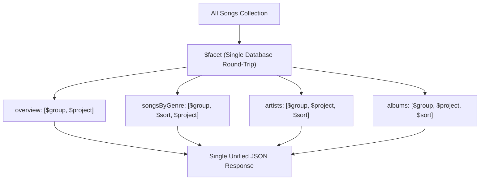
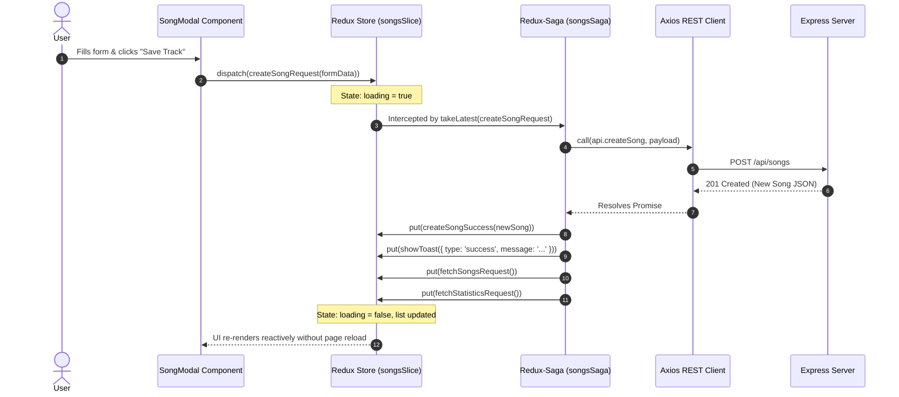

# 🏛️ Swenetix Studio — Architecture & System Design

This document details the architectural principles, component interactions, and data flow patterns of **Swenetix Studio** (`swenetix-studio`). It is written for software engineers, tech leads, and technical evaluators who want to understand the rationale behind every design choice.

---

## 📑 Table of Contents
1. [High-Level Architecture](#1-high-level-architecture)
2. [Backend Architecture (Layered Service Pattern)](#2-backend-architecture-layered-service-pattern)
3. [MongoDB Data Model & Indexing Strategy](#3-mongodb-data-model--indexing-strategy)
4. [Analytics Engine: Multi-Stage `$facet` Aggregation](#4-analytics-engine-multi-stage-facet-aggregation)
5. [Frontend Architecture (React 18 + Emotion + Styled-System)](#5-frontend-architecture-react-18--emotion--styled-system)
6. [State Management & Asynchronous Flow (Redux Toolkit + Redux-Saga)](#6-state-management--asynchronous-flow-redux-toolkit--redux-saga)
7. [Design System & Theme Tokens](#7-design-system--theme-tokens)
8. [Cross-Cutting Concerns (Error Handling, Security, Resilience)](#8-cross-cutting-concerns-error-handling-security-resilience)

---

## 1. High-Level Architecture

Swenetix Studio is designed as a decoupled, production-grade **MERN** (MongoDB, Express, React, Node.js) single-page application (SPA) backed by a stateless REST API.

```mermaid
graph TD
    Client["Client: React 18 SPA (Vite + Emotion + Redux)"]
    API["API Gateway: Express.js REST API (TypeScript)"]
    DB[("Database: MongoDB Atlas 7.0")]

    Client -->|HTTP / JSON (Axios)| API
    API -->|Mongoose Driver| DB
```

### Key Architectural Principles
- **Separation of Concerns**: Strict boundary between routing/controllers, business logic (services), and data persistence (models).
- **Type Safety**: End-to-end TypeScript types shared conceptually between backend DTOs and frontend interfaces, ensuring compile-time safety and zero implicit `any`.
- **Reactive UI**: State changes in the frontend immediately update both local Redux slices and trigger background saga synchronization without requiring manual browser refreshes.
- **Single-Query Analytics**: Complex multi-dimensional metrics (grouped by genre, artist, album, and totals) are executed inside the database kernel in a single round-trip using MongoDB `$facet`.

---

## 2. Backend Architecture (Layered Service Pattern)

The backend follows a classic **Layered (3-Tier) Architecture**:

```text
HTTP Request
     │
     ▼
[Express Router] (src/routes/)
     │  - Maps URLs & HTTP verbs to controllers
     │  - Applies Zod request validation middleware
     ▼
[Controllers] (src/controllers/)
     │  - Extracts params, queries, and request bodies
     │  - Delegates work to services
     │  - Formats HTTP responses (200, 201, 204, etc.)
     ▼
[Services] (src/services/)
     │  - Contains all pure business logic
     │  - Executes Mongoose operations & MongoDB aggregation pipelines
     │  - Handles edge-case domain validations
     ▼
[Models / Schemas] (src/models/)
     │  - Mongoose document schemas & TypeScript interfaces
     │  - Compound and single-field database indexes
     ▼
[MongoDB Engine]
```

### Directory Structure & Responsibilities
- [`src/config/`](file:///e:/dasktopp/my_proj/song-management-app/server/src/config): Database connection options with IPv4 forced resolution (`family: 4`) and connection pooling.
- [`src/controllers/`](file:///e:/dasktopp/my_proj/song-management-app/server/src/controllers): `song.controller.ts` and `statistics.controller.ts`. Pure HTTP handlers.
- [`src/services/`](file:///e:/dasktopp/my_proj/song-management-app/server/src/services): `song.service.ts` (CRUD and pagination) and `statistics.service.ts` (`$facet` aggregation).
- [`src/models/`](file:///e:/dasktopp/my_proj/song-management-app/server/src/models): `song.model.ts` defining Mongoose schemas and compound indexes.
- [`src/middleware/`](file:///e:/dasktopp/my_proj/song-management-app/server/src/middleware): Request validation using Zod and centralized error handling.

---

## 3. MongoDB Data Model & Indexing Strategy

To strictly comply with the test requirements, all songs are stored in a single, well-structured Mongoose model.

### Schema Definition
```typescript
interface ISongDocument extends Document {
  title: string;
  artist: string;
  album: string;
  genre: string;
  duration?: number;
  year?: number;
  createdAt: Date;
  updatedAt: Date;
}
```

### Indexing Strategy
To optimize both search queries and aggregation speeds:
1. **Compound Text Index**:
   ```typescript
   SongSchema.index({ title: 'text', artist: 'text', album: 'text' });
   ```
   Enables high-performance keyword search across multiple fields simultaneously.
2. **Category Filter Indexes**:
   ```typescript
   SongSchema.index({ genre: 1 });
   SongSchema.index({ artist: 1 });
   SongSchema.index({ album: 1 });
   ```
   Ensures instantaneous grouping and filtering during aggregation and table pagination.
3. **Sorting Index**:
   ```typescript
   SongSchema.index({ createdAt: -1 });
   ```
   Ensures recent song listings are retrieved without in-memory sorting.

---

## 4. Analytics Engine: Multi-Stage `$facet` Aggregation

One of the highlights of Swenetix Studio is the implementation of MongoDB's `$facet` operator located in [`server/src/services/statistics.service.ts`](file:///e:/dasktopp/my_proj/song-management-app/server/src/services/statistics.service.ts).

### Why `$facet`?
Standard approaches execute 4 to 5 separate queries (`countDocuments`, `distinct`, `group` by genre, `group` by artist, etc.), resulting in multiple database round-trips and increased network latency.

`$facet` executes multiple parallel aggregation pipelines within a single stage on the incoming documents:



### Pipeline Breakdown:
1. **`overview`**: Accumulates distinct arrays using `$addToSet` for `artist`, `album`, and `genre`, then computes `$size` to return total counts in one pass.
2. **`songsByGenre`**: Groups documents by `genre`, sums totals, and sorts in descending order.
3. **`artists`**: Groups by `artist`, tallies total tracks, and calculates distinct albums using `$addToSet`.
4. **`albums`**: Groups by composite key `{ album, artist }` and tallies track counts.

---

## 5. Frontend Architecture (React 18 + Emotion + Styled-System)

The frontend is an SPA created with React 18, Vite, and TypeScript.

### Component Tree
```text
<Provider store={store}>
  <SidebarProvider>
    <CustomThemeProvider>
      <BrowserRouter>
        <AppLayout>
          ├── <Sidebar />       (Fixed 100vh, Collapsible 76px / 260px)
          └── <MainContent>
                ├── <Header />  (Search bar, Add Song button, Dark/Light switch)
                ├── <Toast />   (Notification feedback for all Saga effects)
                └── <AppRoutes>
                      ├── <StartPage />    (100vh Hero + Equalizer Canvas)
                      ├── <Songs />        (Table / Grid CRUD + Modals)
                      ├── <Statistics />   (Analytics Dashboard)
                      └── <Home />         (Executive Overview Hub)
```

---

## 6. State Management & Asynchronous Flow (Redux Toolkit + Redux-Saga)

Swenetix Studio uses **Redux Toolkit** for immutable state management and **Redux-Saga** for side effects.

### Lifecycle of a Song Creation Action:


### Why Redux-Saga?
- **Declarative Effects**: `call`, `put`, `select`, and `takeLatest` allow asynchronous flows to be tested as pure data without mocking network layers.
- **Race Condition Prevention**: `takeLatest` automatically cancels pending obsolete requests if the user rapidly changes search filters.
- **Chained Side-Effects**: Mutating actions (Create, Update, Delete) automatically dispatch refresh queries for catalog and analytics in one clean flow.

---

## 7. Design System & Theme Tokens

Styling is built with `@emotion/styled` and `styled-system` primitives.

- **Tokens Definition**: Located in [`client/src/theme/theme.ts`](file:///e:/dasktopp/my_proj/song-management-app/client/src/theme/theme.ts).
- **Color Palette**: High-contrast, accessibility-checked colors tailored for modern Dark and Light aesthetics.
- **Responsive Layout Primitives**: `Box`, `Flex`, `Card`, `Badge`, `Button`, and `Input` accept theme tokens directly as props.

---

## 8. Cross-Cutting Concerns

### Centralized Error Handling
- The server employs a global error middleware ([`server/src/middleware/error.middleware.ts`](file:///e:/dasktopp/my_proj/song-management-app/server/src/middleware/error.middleware.ts)) that captures all Mongoose validation errors, duplicate keys, and Zod schema violations, returning a standardized JSON error format:
```json
{
  "success": false,
  "message": "Validation Error",
  "errors": ["'title' is required"]
}
```

### Resilience & Cloud Compatibility
- Connection retry logic handles transient Atlas IP whitelist and TLS alerts.
- IPv4 address resolution ensures compatibility across diverse Node.js runtime environments.
