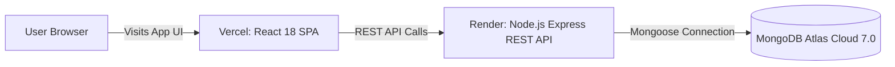

# 🚀 Swenetix Studio — Complete Production Deployment Guide

This guide provides step-by-step instructions for deploying **Swenetix Studio** (`swenetix-studio`) to production across multiple hosting strategies.

---

## 📑 Table of Contents
1. [Deployment Strategy Comparison](#1-deployment-strategy-comparison)
2. [Method 1: Cloud Serverless / PaaS (Vercel + Render + MongoDB Atlas)](#2-method-1-cloud-serverless--paas-vercel--render--mongodb-atlas)
   - [Step A: MongoDB Atlas Setup](#step-a-mongodb-atlas-setup)
   - [Step B: Deploy Backend to Render](#step-b-deploy-backend-to-render)
   - [Step C: Deploy Frontend to Vercel](#step-c-deploy-frontend-to-vercel)
3. [Method 2: Multi-Container Docker Compose (VPS / Local)](#3-method-2-multi-container-docker-compose-vps--local)
4. [Method 3: Linux VPS (Ubuntu + PM2 + Nginx + Let's Encrypt SSL)](#4-method-3-linux-vps-ubuntu--pm2--nginx--lets-encrypt-ssl)
5. [Environment Variables Reference](#5-environment-variables-reference)
6. [Post-Deployment Verification & Health Checks](#6-post-deployment-verification--health-checks)

---

## 1. Deployment Strategy Comparison

| Strategy | Best For | Complexity | Cost | Live URL Example |
| :--- | :--- | :---: | :---: | :--- |
| **Vercel + Render + Atlas** | **Test Submissions & Portfolios** | Low | Free | `https://swenetix-studio.vercel.app` |
| **Docker Compose** | **Local, CI/CD, Single-box VPS** | Low | Low | `http://your-vps-ip:3000` |
| **Ubuntu VPS + Nginx + PM2** | **Production Grade Enterprise** | Medium | $4-$6/mo | `https://swenetix.yourdomain.com` |

---

## 2. Method 1: Cloud Serverless / PaaS (Vercel + Render + MongoDB Atlas)

This is the recommended deployment method for Addis Software test submissions to provide live, fast, and accessible URLs.



---

### Step A: MongoDB Atlas Setup
1. Log in to [MongoDB Atlas](https://cloud.mongodb.com/).
2. Create or select a free **M0 Sandbox Cluster**.
3. Under **Security → Network Access**, add IP Address: `0.0.0.0/0` (Allow access from anywhere, required for dynamic cloud hosting like Render/Vercel).
4. Under **Security → Database Access**, create a user with `Read and write to any database` privileges.
5. Obtain your SRV Connection String:
   ```text
   mongodb+srv://<username>:<password>@cluster0.jmhdspj.mongodb.net/song_management_db?retryWrites=true&w=majority
   ```

---

### Step B: Deploy Backend to Render
1. Push your repository to GitHub.
2. Sign in to [Render.com](https://render.com) and click **New + → Web Service**.
3. Connect your GitHub repository: `swenetix-studio`.
4. Configure the Web Service:
   - **Name**: `swenetix-studio-api`
   - **Region**: Closest to you (e.g., Frankfurt or Oregon)
   - **Branch**: `main`
   - **Root Directory**: `server`
   - **Runtime**: `Node`
   - **Build Command**: `npm install && npm run build`
   - **Start Command**: `npm start`
   - **Plan**: `Free`
5. Add **Environment Variables**:
   | Key | Value |
   | :--- | :--- |
   | `NODE_ENV` | `production` |
   | `PORT` | `5000` |
   | `MONGODB_URI` | `mongodb+srv://<user>:<password>@cluster0.jmhdspj.mongodb.net/song_management_db?retryWrites=true&w=majority` |
   | `CORS_ORIGIN` | `*` |
6. Click **Deploy Web Service**.
7. Once deployed, note your Render backend URL (e.g., `https://swenetix-studio-api.onrender.com`).
8. Verify health at `https://swenetix-studio-api.onrender.com/api/health`.

---

### Step C: Deploy Frontend to Vercel
1. Sign in to [Vercel.com](https://vercel.com) and click **Add New... → Project**.
2. Select your repository `swenetix-studio`.
3. Configure project settings:
   - **Framework Preset**: `Vite`
   - **Root Directory**: Click *Edit* and select `client`
   - **Build Command**: `npm run build`
   - **Output Directory**: `dist`
4. Add **Environment Variables**:
   | Key | Value |
   | :--- | :--- |
   | `VITE_API_URL` | `https://swenetix-studio-api.onrender.com/api` |
5. Click **Deploy**.
6. Vercel will build and assign a domain (e.g., `https://swenetix-studio.vercel.app`).

---

## 3. Method 2: Multi-Container Docker Compose (VPS / Local)

Deploy the complete stack (MongoDB + Express Backend + Nginx-served React SPA) on any machine with Docker installed.

### 1. Clone & Configure
```bash
git clone https://github.com/Eliasyirga/swenetix-studio.git
cd swenetix-studio
```

### 2. Run Container Stack
```bash
docker compose up --build -d
```

### 3. Verification
- **Frontend SPA**: `http://localhost:3000`
- **Backend API**: `http://localhost:5000`
- **API Healthcheck**: `http://localhost:5000/api/health`

### 4. Stop Containers
```bash
docker compose down
```

---

## 4. Method 3: Linux VPS (Ubuntu + PM2 + Nginx + Let's Encrypt SSL)

For hosting on a cloud VPS instance (e.g. DigitalOcean, AWS Lightsail, Hetzner):

### 1. Install Node.js, PM2, and Nginx
```bash
sudo apt update && sudo apt upgrade -y
curl -fsSL https://deb.nodesource.com/setup_20.x | sudo -E bash -
sudo apt install -y nodejs nginx git
sudo npm install -g pm2
```

### 2. Setup Backend with PM2
```bash
cd /var/www
git clone https://github.com/Eliasyirga/swenetix-studio.git
cd swenetix-studio/server
npm install
npm run build
pm2 start dist/server.js --name "swenetix-api"
pm2 save
pm2 startup
```

### 3. Build Frontend
```bash
cd /var/www/swenetix-studio/client
npm install
VITE_API_URL="https://api.yourdomain.com/api" npm run build
```

### 4. Configure Nginx Reverse Proxy
Create `/etc/nginx/sites-available/swenetix`:
```nginx
server {
    listen 80;
    server_name yourdomain.com www.yourdomain.com;

    root /var/www/swenetix-studio/client/dist;
    index index.html;

    location / {
        try_files $uri $uri/ /index.html;
    }

    location /api/ {
        proxy_pass http://localhost:5000/api/;
        proxy_http_version 1.1;
        proxy_set_header Upgrade $http_upgrade;
        proxy_set_header Connection 'upgrade';
        proxy_set_header Host $host;
        proxy_cache_bypass $http_upgrade;
    }
}
```
Enable the site and obtain free SSL:
```bash
sudo ln -s /etc/nginx/sites-available/swenetix /etc/nginx/sites-enabled/
sudo nginx -t && sudo systemctl reload nginx
sudo apt install -y certbot python3-certbot-nginx
sudo certbot --nginx -d yourdomain.com -d www.yourdomain.com
```

---

## 5. Environment Variables Reference

### Backend (`server/.env`)
| Variable | Default (Local) | Production Example | Description |
| :--- | :--- | :--- | :--- |
| `PORT` | `5000` | `5000` | Server listener port |
| `NODE_ENV` | `development` | `production` | Environment mode |
| `MONGODB_URI` | `mongodb://localhost:27017/song_db` | `mongodb+srv://...` | MongoDB connection URI |
| `CORS_ORIGIN` | `*` | `https://swenetix-studio.vercel.app` | Allowed CORS origins |

### Frontend (`client/.env`)
| Variable | Default (Local) | Production Example | Description |
| :--- | :--- | :--- | :--- |
| `VITE_API_URL` | `http://localhost:5000/api` | `https://api.domain.com/api` | Full base URL to the REST API |

---

## 6. Post-Deployment Verification & Health Checks

After deployment, test the following endpoints to verify full functionality:

1. **Health Check**:
   ```bash
   curl -I https://<your-backend-url>/api/health
   # Expected: HTTP 200 OK with {"status":"healthy"}
   ```
2. **Catalog Analytics Pipeline**:
   ```bash
   curl https://<your-backend-url>/api/statistics
   # Expected: JSON object with overview, songsByGenre, artists, and albums
   ```
3. **Database Seeding (If catalog is empty)**:
   ```bash
   curl -X POST https://<your-backend-url>/api/songs/seed
   # Expected: 59 tracks seeded successfully
   ```
4. **UI Navigation**:
   - Open frontend URL in browser.
   - Verify Start Page 3D equalizer canvas loads.
   - Navigate to `/songs` and test creating, editing, and deleting a song.
   - Navigate to `/statistics` and confirm real-time metrics display.
